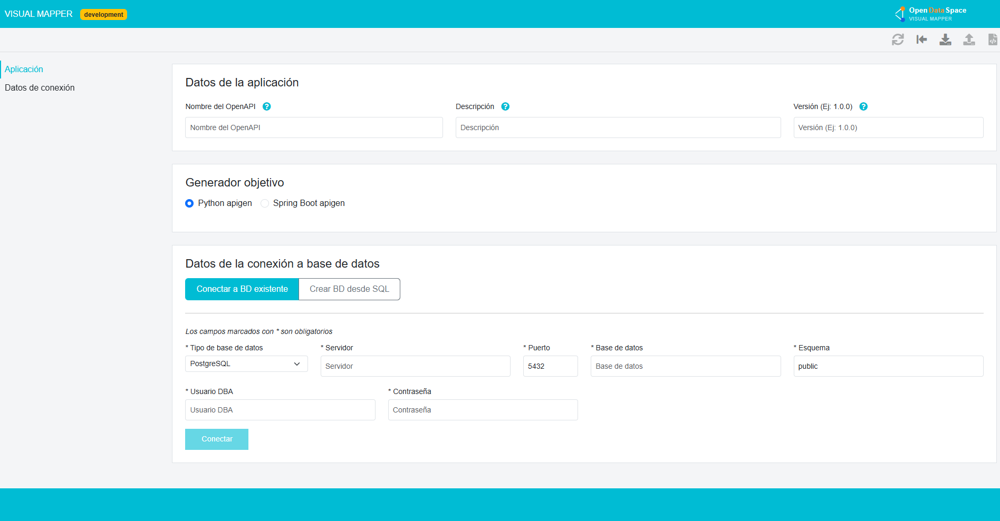

# Visual Mapper


Visual Mapper is a Vue 3 + TypeScript front-end for enriching OpenAPI or AsyncAPI definitions with `x-apigen-*` metadata, mapping API resources to relational database structures, and exporting the resulting specification back to a parent application or to downstream code-generation services.

<p align="center">
	<a href="https://apiaddicts.org/">
	  
	</a>
</p>

## What the application does

Visual Mapper helps you:

- import an OpenAPI definition (`.yaml`, `.yml`, `.json`) or an AsyncAPI definition (`.yaml`, `.yml`)
- connect to an existing database and inspect tables
- create a temporary database from a SQL file
- derive entities, controllers, relations, and validations from the connected schema
- enrich the API definition with `x-apigen-*` extensions
- preview or download the enriched OpenAPI / AsyncAPI document
- optionally trigger archetype/code generation through configured Apigen backends
- run embedded inside an iframe and exchange data with a parent application through `window.postMessage`

## Tech stack

| Area | Details |
| --- | --- |
| Framework | Vue 3 |
| Language | TypeScript |
| State | Vuex |
| Routing | Vue Router |
| UI | Bootstrap 5 + bootstrap-vue-3 |
| i18n | vue-i18n |
| HTTP | Axios |
| Build tooling | Vue CLI 5 / Webpack |
| Testing | Mocha + Chai via `vue-cli-service test:unit` |

## Requirements

- Node.js `>= 24.13.0`
- npm `>= 8.3.0`

## Installation

```bash
npm install
```

## Available scripts

| Command | Description |
| --- | --- |
| `npm run serve` | Starts the local development server |
| `npm run build` | Builds the production bundle into `dist/` |
| `npm run lint` | Runs ESLint |
| `npm run test:unit` | Runs the unit test suite |

## Environment configuration

The project uses `.env` files at the repository root. `.env` is loaded by default. Additional files such as `.env.production` or `.env.<mode>` can be used with Vue CLI modes.

> The repository currently exposes generic scripts only. If you need a specific mode, use Vue CLI mode support directly, for example: `npx vue-cli-service build --mode production`.

### Environment variables

| Variable | Required | Description |
| --- | --- | --- |
| `VUE_APP_ENV` | Yes | Runtime environment label, typically `development` or `production` |
| `VUE_APP_PUBLIC_PATH` | Yes | Base public path used by Vue Router and static assets |
| `VUE_APP_CONFIG_GEN_API_URL` | Yes | Base URL for the configuration generator backend |
| `VUE_APP_PROJECT_GEN_API_URL` | Yes | Base URL for the project/archetype generator backend |
| `VUE_APP_AUTH_URL` | If OAuth is enabled | OAuth 2 client credentials token endpoint |
| `VUE_APP_AUTH_CLIENT_ID` | If OAuth is enabled | OAuth client ID |
| `VUE_APP_AUTH_CLIENT_SECRET` | If OAuth is enabled | OAuth client secret |
| `VUE_APP_REQUEST_RETRY` | No | Retry count used by project generation requests |
| `VUE_APP_OAUTH_GENERATE_ACCESS_TOKEN` | No | `1` enables token retrieval and bearer token injection; `0` disables it |
| `VUE_APP_CONFIG_GEN_STATUS_URL` | No | Health/status URL for the configuration generator backend |
| `VUE_APP_PROJECT_GEN_STATUS_URL` | No | Health/status URL for the project generator backend |
| `VUE_APP_WSO2_STATUS_URL` | No | Optional status URL shown in the footer connectivity modal |
| `VUE_APP_APIGEN_DOTNET_URL` | No | .NET Apigen backend URL |
| `VUE_APP_APIGEN_SPRINGBOOT_URL` | No | Spring Boot Apigen backend URL |
| `VUE_APP_APIGEN_PYTHON_URL` | No | Python Apigen backend URL |
| `VUE_APP_DB_EXPLORER_URL` | Yes in production | Database Explorer backend URL |
| `VUE_APP_API_KEY` | Optional, backend-dependent | API key forwarded to the Database Explorer service |
| `VUE_APP_DEBUG_PODS` | No | Enables round-robin requests between debug pod URLs when set to `1` |
| `VUE_APP_CONFIG_GEN_API_URL_DEBUG_POD1` | No | Alternate config generator URL for debug routing |
| `VUE_APP_CONFIG_GEN_API_URL_DEBUG_POD2` | No | Alternate config generator URL for debug routing |
| `PORT` | No | Local development server port |

### Automatically injected build metadata

The application also injects these values at build time from `package.json`:

- `VUE_APP_VERSION`
- `VUE_APP_NAME`
- `VUE_APP_DESCRIPTION`
- `VUE_COMPILATION_DATE`

You normally do not define them manually.

## Local development

```bash
npm run serve
```

The development server uses proxies defined in `vue.config.js` for:

- `/api-apigen-dotnet`
- `/api-apigen-springboot`
- `/api-apigen-python-dev`
- `/db-explorer`
- `/api-apiquality`

## Production build

```bash
npm run build
```

The output directory is `dist/`.

## Real application workflow

In normal usage, the flow is:

1. Fill in application metadata (`name`, `description`, `version`).
2. Choose the target framework when running standalone.
3. Connect to an existing database or create a temporary one from a SQL file.
4. Import an OpenAPI or AsyncAPI definition, or receive it from a parent iframe host.
5. Review generated resources/entities and adjust mappings.
6. Preview or export the enriched specification.
7. Optionally trigger archetype/code generation through a configured Apigen backend.

## Database support

### Connect to an existing database

The connection form supports these database types:

- `POSTGRES`
- `ORACLE`
- `MYSQL`
- `SQLSERVER`
- `MARIADB`

### Create a temporary database from SQL

The "create database" flow currently exposes:

- `POSTGRES`
- `MYSQL`

You can upload a `.sql` file, preview an ER diagram, or generate SQL from an already loaded OpenAPI document before creating the temporary database.

## API definition import support

### OpenAPI

- Accepted formats: `.yaml`, `.yml`, `.json`
- Extracts `info.title`, `info.description`, and `info.version`
- Imports controllers/resources from the specification
- If a database connection is active, it continues with the table/config import pipeline

### AsyncAPI

- Accepted formats: `.yaml`, `.yml`
- Extracts `info.title`, `info.description`, and `info.version`
- Extracts server names
- Loads AsyncAPI controllers/entities locally before continuing with mapping

## Supported Apigen technologies

Visual Mapper generates `x-apigen-*` extensions compatible with these target technologies:

| Value | Framework | Notes |
| --- | --- | --- |
| `python` | Python Apigen | Default value |
| `springboot` | Spring Boot Apigen | Requires `group-id` and `artifact-id` |
| `dotnet` | .NET Apigen | Supported by the backend integration layer |

> In the current standalone UI, the visible target framework selector exposes Python and Spring Boot. The iframe contract and backend service layer also recognize `dotnet`.

### `x-apigen-project` differences by technology

**Python / .NET**

```yaml
x-apigen-project:
  name: my-api
  description: My API
  version: 1.0.0
  data-driver: mysql
```

**Spring Boot**

```yaml
x-apigen-project:
  name: my-api
  description: My API
  version: 1.0.0
  data-driver: mysql
  java-properties:
    group-id: com.example
    artifact-id: my-api
```

### `x-apigen-models`

Generated from the database schema to describe the relational model:

```yaml
x-apigen-models:
  Pet:
    relational-persistence:
      table: pets
    attributes:
      - name: id
        type: Long
        relational-persistence:
          primary-key: true
          autogenerated: true
      - name: name
        type: String
      - name: owner
        type: Owner
        relational-persistence:
          column: owner_id
      - name: visits
        type: Array
        items-type: Visit
        relational-persistence:
          foreign-column: pet_id
```

### `x-tyk-anonymization`

Marks response fields that should be anonymized by the Tyk gateway:

```yaml
x-tyk-anonymization:
  - field: email
    type: email
  - field: phone
    type: phone
  - field: name
    type: swap
    swap-list: names
```

Available anonymization types:

- `email`
- `phone`
- `name`
- `dni`
- `iban`
- `swap` (requires `swap-list`)

## Iframe integration (postMessage)

Visual Mapper can run embedded inside an `<iframe>`. Communication is done through `window.postMessage`.

### Incoming message (parent -> Visual Mapper)

The parent page can send this object after the iframe is loaded:

```json
{
  "openapi_yaml_in_base64": "<base64-encoded OpenAPI or JSON content>",
  "apigen_type": "springboot",
  "database": {
    "credentials": {
      "type": "POSTGRES",
      "host": "localhost",
      "port": "5432",
      "name": "mydb",
      "schema": "public",
      "username": "admin"
    },
    "generated": {
      "connection_id": "abc-123"
    }
  }
}
```

| Field | Required | Description |
| --- | --- | --- |
| `openapi_yaml_in_base64` | Yes | OpenAPI content in YAML or JSON format, encoded in base64 |
| `apigen_type` | No | Target technology: `python` (default), `springboot`, `dotnet` |
| `database.credentials` | No | Existing database connection data used to prefill the connection form |
| `database.credentials.type` | No | Database type: `POSTGRES`, `MYSQL`, `MARIADB`, `SQLSERVER`, `ORACLE` |
| `database.credentials.host` | No | Database host |
| `database.credentials.port` | No | Database port |
| `database.credentials.name` | No | Database name |
| `database.credentials.schema` | No | Database schema |
| `database.credentials.username` | No | Database username |
| `database.generated` | No | Model field reserved for previously generated database sessions |
| `database.generated.connection_id` | No | Previously stored temporary connection identifier |

### What happens when the message is received

The current frontend implementation:

- stores the iframe configuration in Vuex
- extracts `title`, `description`, and `version` from the provided OpenAPI document
- applies `apigen_type` to the target framework
- prefills database connection fields from `database.credentials`
- does **not** prefill the database password
- auto-imports the OpenAPI definition once the connection and application data are ready

### Important note about `database.generated.connection_id`

The data model includes `database.generated.connection_id`, and the original README describes an auto-connect flow for it. However, the current frontend code does **not** consume that value during iframe initialization. Treat it as part of the contract model, not as an implemented auto-reconnect feature in the present UI.

### Parent page example

```javascript
const iframe = document.getElementById('visual-mapper');

iframe.contentWindow.postMessage({
  openapi_yaml_in_base64: btoa(yamlContent),
  apigen_type: 'springboot',
  database: {
    credentials: {
      type: 'POSTGRES',
      host: 'localhost',
      port: '5432',
      name: 'mydb',
      schema: 'public',
      username: 'admin'
    }
  }
}, '*');
```

### Outgoing messages (Visual Mapper -> parent)

#### Temporary database created

Emitted when the user creates a temporary database from a SQL file:

```json
{
  "type": "connection-created",
  "connection_id": "abc-123"
}
```

Example listener:

```javascript
window.addEventListener('message', (event) => {
  if (event.data?.type === 'connection-created') {
    localStorage.setItem('vm_connection_id', event.data.connection_id);
  }
});
```

#### Enriched OpenAPI / AsyncAPI document

Emitted when the user clicks **Send to API Quality**:

```json
{
  "type": "openapi-update",
  "content_in_base64": "<base64-encoded enriched OpenAPI>"
}
```

```json
{
  "type": "asyncapi-update",
  "content_in_base64": "<base64-encoded enriched AsyncAPI>"
}
```

Example decode logic:

```javascript
window.addEventListener('message', (event) => {
  if (event.data?.type === 'openapi-update') {
    const yaml = decodeURIComponent(escape(atob(event.data.content_in_base64)));
    // use the enriched yaml
  }
});
```

#### Code generation response passthrough

When Visual Mapper is embedded and the user triggers full or partial code generation, the frontend forwards the JSON payload returned by the generator backend directly to the parent window:

```javascript
window.addEventListener('message', (event) => {
  // event.data shape depends on the configured generator backend
  console.log(event.data);
});
```

Because the payload is forwarded as-is from the backend response, its exact structure depends on the configured generator service and is not enforced by this frontend.

### Security note

The current implementation sends messages with `'*'` as target origin. Parent applications should validate `event.origin` and `event.data` in their message listeners.

## Docker

The repository includes:

- a `Dockerfile`
- an `nginx.conf`

The Docker image builds the Vue application and serves the static `dist/` output with Nginx.
